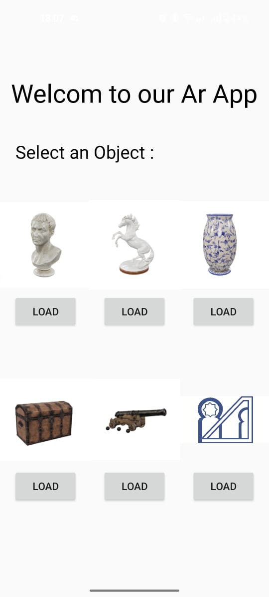
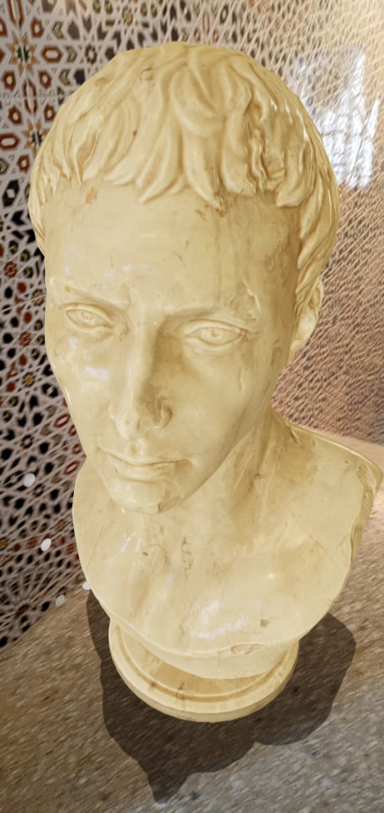
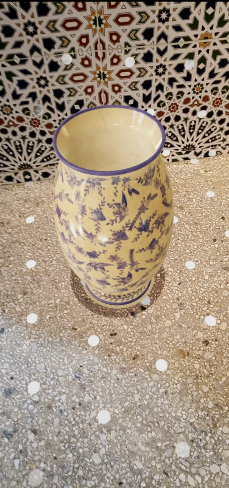

# Android Augmented Reality Application
This project is an Android application that leverages Sceneform to enable the display of digital 3D objects on real-world surfaces using augmented reality technology.
**Features**
- **Model Selection:** Choose from a variety of 3D models to render.

- **AR Visualization**: View selected models overlaid onto real-world surfaces through your device’s camera.

- **Model Interaction**:
   - Adjust the position of the model.

   - Rotate the model to any desired angle.

   - Scale the model to fit your environment appropriately.

**Technologies Used**
- Android (Java)

- Sceneform SDK

- ARCore

**Preview**

- *Home Page*

- *Demo 1*

- *Demo 2*

